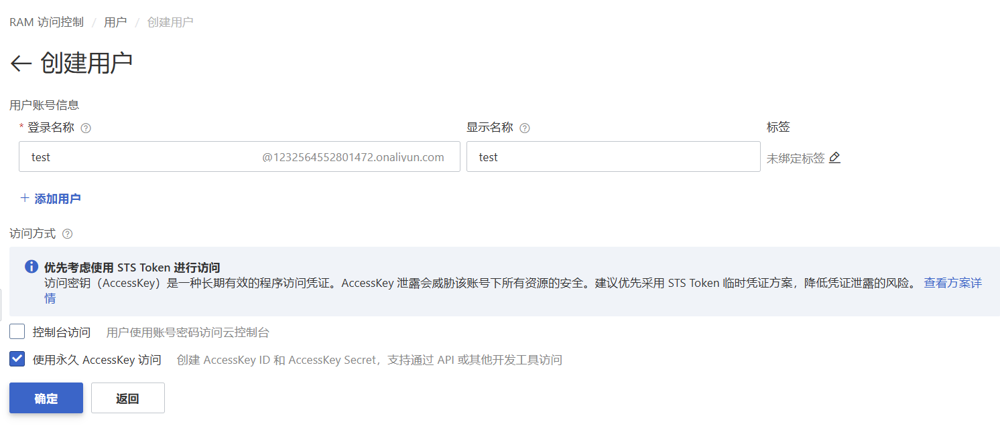

# slowlyRecord

This template should help get you started developing with Vue 3 in Vite.

## Recommended IDE Setup

[VSCode](https://code.visualstudio.com/) + [Volar](https://marketplace.visualstudio.com/items?itemName=Vue.volar) (and disable Vetur).

## Type Support for `.vue` Imports in TS

TypeScript cannot handle type information for `.vue` imports by default, so we replace the `tsc` CLI with `vue-tsc` for type checking. In editors, we need [Volar](https://marketplace.visualstudio.com/items?itemName=Vue.volar) to make the TypeScript language service aware of `.vue` types.

## Customize configuration

See [Vite Configuration Reference](https://vite.dev/config/).

## Project Setup

```sh
npm install
```

### Compile and Hot-Reload for Development

```sh
npm run dev
```

### Type-Check, Compile and Minify for Production

```sh
npm run build
```


### 功能列表
#### 当前版本功能
-[x] 数据库持久化  ok
-[x] 导入，导出  2025年4月23日 ok
-[x] 播放声音 2025年4月21日ok
  - https://dict.youdao.com/dictvoice?audio=look&type=1 这个地址可能不需要用key
  - 播放声音 （是否能下载到本地，减少调用接口的次数）ok
- 20250528
  -[x] 打包后无法正确调用接口
  -[x] 打包后图标无法正确显示 
- 20251118
  - bug
    1. 修复统计错误
    2. 列表没有单词时,改为显示没有数据
  - 功能 
    1. 添加永久记住功能
    2. 修改单词默认等级从1级开始
    3. 添加一键显示与隐藏释义功能 
    4. 添加置顶置底功能
    5. 添加定位到新增单词功能
- 2025119
  - 修复数据库保存未成功
- 20251124
  1. [x] 支持txt或csv导入,并补全导入文件的释义与发音.(导入说明,txt与csv一行一个单词,支持直接单词或完整格式)
  2. [x] 添加按钮文字提示
  3. [x] 修改音频缓存
      -[x] 如果是之前导入的单词无法听声音    播放音频,没有音频的功能要先查后存
- 20251129
  1. [x] 永久记住单词,单独查看,导出,与恢复 (给一个状态,如果是记住,其他按钮禁用)
  2. [x] 已记完的单词,查看,导出
  3. [x] 只导出未记住的单词
  4. [x] 添加列表单词筛选只查看对应状态下的单词
  5. [x] 优化样式
  6. [x] 添加单词释义编辑功能
  - 三级
      - [x] 单词越来越多时,打开主界面时间过长
- 20251207
    - bug
        - [] 置项与置底功能不能用了
    1. [] 显示释义与隐藏 （不要修改之前的状态，只是释义不再进行判断）（与记住，忘记的状态无关）
    2. [] 划词翻译 保存功能 （是否 直接添加），
#### 下个版本功能
- 待添加功能
  1. [] 添加翻译切换功能
  3. [] 截图翻译 保存功能  （是否 直接添加）
  1. [] 修改单词翻译（减少调用接口的次数）加入本地(无网)翻译功能
  4. [] 多端同步功能
  5. [] 切换词库
  7. [] 更新插件使用说明 ,与截图
  8. [] 添加单词到有道单词本
  9. [] 切换别的api接口,添加单词
  10. [] 如果单词释义过长,会被遮盖,最好两行同时加高
  12. [] 专注模式（只显示当前一个单词，配合快捷键）
  11. [] 添加快捷键，与专注模式，最好一起添加
  14. [] 内容中选择要添加的单词
  15. [] 复制，选中内容，进行折词，选词，后一起添加 （精准选词，与范围选词）
- bug
  - 一级
    - [] 显示音标
        - https://mobile.youdao.com/dict?le=eng&q=red
        - <span class="phonetic">[red]</span>  这里能找到
    - [] 如果查询不到单词,或者网络有问题,最次也要把原内容直接存起来,不要报错
  - 二级
      -[ ] 导入成功后,打开列表面板,不然操作不太统一
- 当前版本更新的内容
  - 插件 介绍里添加 英语两个字
        - [] 添加一个选中的样式

### 项目简单逻辑说明
- 目前以本地数据库为准，如果数据不一致，会以本地数据库为准，后期可以看一下是否需要判断数据库是否一直为最新
### 项目介绍
一个根据遗忘曲线辅助记忆单词的工具
使用方法: 主输入框输入任一正确单词后,选择"加入单词簿"，自动翻译后加入学习列表显示,主界面输入review关键字，可进入单词列表复习，
每次有效复习后会更新单词等级，延长下次复习时间，直到完成长期记忆。翻译内容支持修改，单词列表支持导入，导出。
导入支持json,txt,csv三种文件类型,每种类型有两种模板格式
1. 直接单词换行
2. 完整结构,方便保留上次状态
    - json
    - txt


  
## 授权管理
- 阿里云配置
  - 开通翻译api调用服务https://mt.console.aliyun.com/service
  - 创建专用账户，勾选使用永久 AccessKey 访问。
  - 复制AccessKey ID和AccessKey Secret,页面关闭后无法再次查看
  - 点击添加授权https://ram.console.aliyun.com/users一定要同时打开管理机器翻译权限，否则无法调用 

