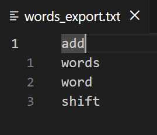
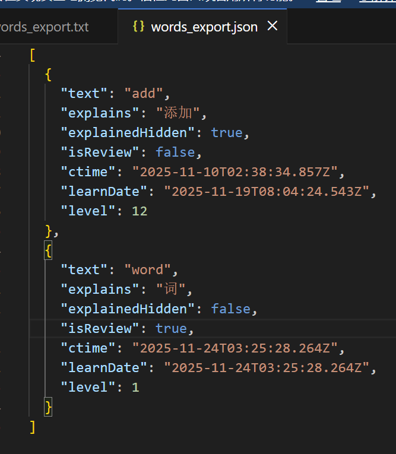
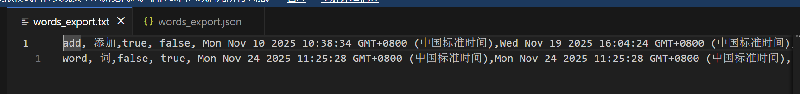
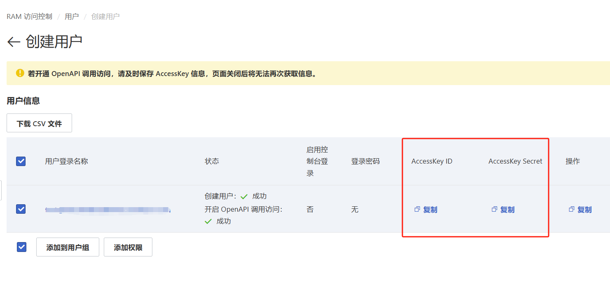
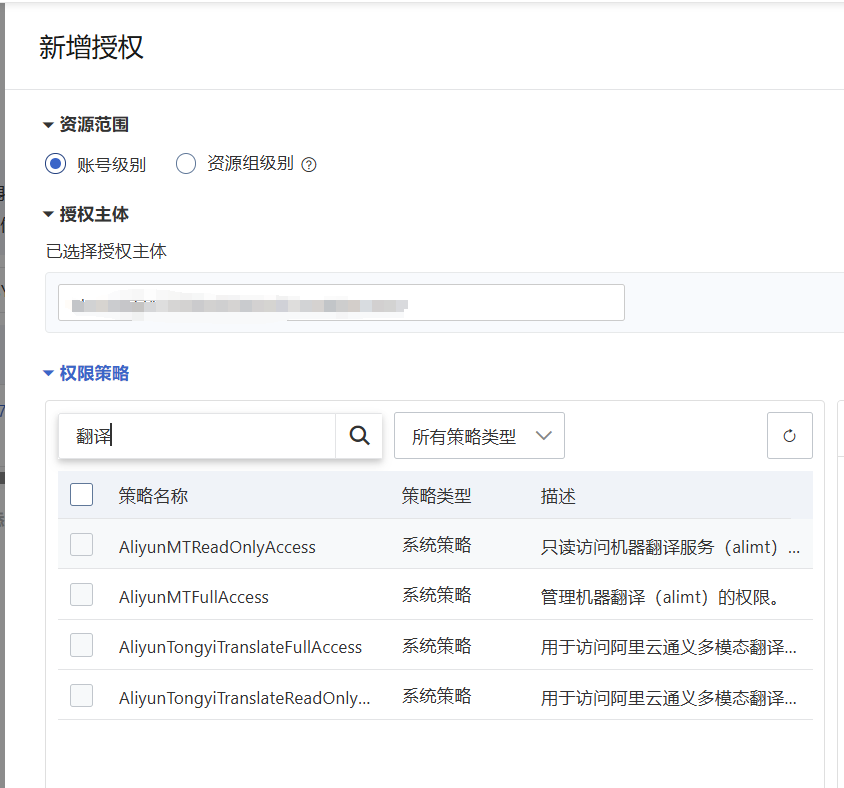
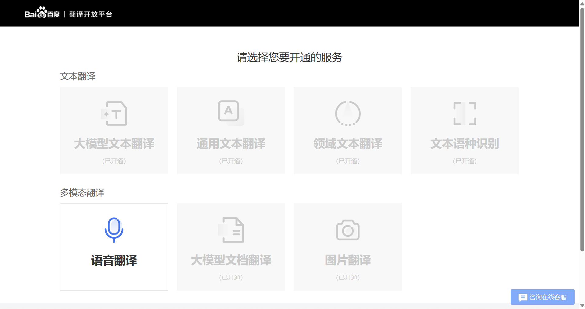
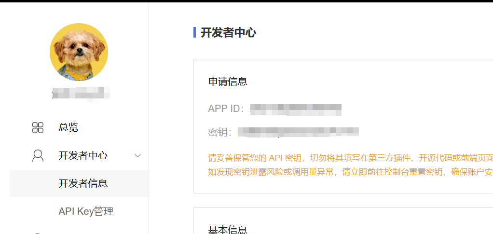

# slowlyRecord

This template should help get you started developing with Vue 3 in Vite.

## Recommended IDE Setup

[VSCode](https://code.visualstudio.com/) + [Volar](https://marketplace.visualstudio.com/items?itemName=Vue.volar) (and disable Vetur).

## Type Support for `.vue` Imports in TS

TypeScript cannot handle type information for `.vue` imports by default, so we replace the `tsc` CLI with `vue-tsc` for type checking. In editors, we need [Volar](https://marketplace.visualstudio.com/items?itemName=Vue.volar) to make the TypeScript language service aware of `.vue` types.

## Customize configuration

See [Vite Configuration Reference](https://vite.dev/config/).

## Project Setup

```sh
npm install
```

### Compile and Hot-Reload for Development

```sh
npm run dev
```

### Type-Check, Compile and Minify for Production

```sh
npm run build
```


  - 由于截图翻译成本较高，暂时限制直接使用次数每日10次(后期看情况调整)，
  配置自己的密钥后不再限制，自己额度基本够用，截图主要使用者，希望尽量使用自己的免费额度
### 项目简单逻辑说明
- 目前以本地数据库为准，如果数据不一致，会以本地数据库为准，后期可以看一下是否需要判断数据库是否一直为最新
### 项目介绍
一个根据遗忘曲线辅助记忆单词的工具
使用方法: 主输入框输入任一正确单词后,选择"加入单词簿"，自动翻译后加入学习列表显示,主界面输入review关键字，可进入单词列表复习，
每次有效复习后会更新单词等级，延长下次复习时间，直到完成长期记忆。翻译内容支持修改，单词列表支持导入，导出。
导入支持json,txt,csv三种文件类型,每种类型有两种模板格式
1. 直接单词换行
2. 完整结构,方便保留上次状态
    - json
    - txt


  
## 授权管理
- 阿里云配置
  - 开通翻译api调用服务https://mt.console.aliyun.com/service
  - 创建专用账户，勾选使用永久 AccessKey 访问。
  - 复制AccessKey ID和AccessKey Secret,页面关闭后无法再次查看
  - 点击添加授权https://ram.console.aliyun.com/users一定要同时打开管理机器翻译权限，否则无法调用 
- 百度去appkey设置
  - 注册登陆，申请成为开发者
  - https://api.fanyi.baidu.com/manage/developer
  - 开通通用文本翻译
  - https://fanyi-api.baidu.com/choose
  - 在开发者信息中找到appid与密钥
- 有道key
  - https://ai.youdao.com/console/#/service-singleton/text-translation
  - 创建应用选择文本翻译
- 千问模型
  - https://bailian.console.aliyun.com/cn-beijing/?tab=model#/efm/model_experience_center/text
- kimi
  - https://platform.moonshot.cn/console/account
- ollama
  - https://ollama.com/download
  - # 在终端1：启动服务（保持运行）`ollama serve` # 在终端2：测试模型 `ollama run qwen2.5:0.5b "你好"`
- deeskeep
  - https://platform.deepseek.com/usage

- 输入
  - mj: 单词
    - 弹出 翻译列表
      - 选择后，进入主界面
  - mj / revier
    - 直接进入主界面
  - mj: ss  /ss  
    - 截图
      - 弹出截图后 ，识别的列表
  - over
    - 直接进入主界面
  - mg:hc / hc
    - 划词添加
  
## 使用方法
- 截图翻译
  - 使用快捷键触发截图
  - 选择翻译平台（有道、百度、阿里云）
  - 系统自动识别图片中的文字并翻译
  - 结果展示在界面上
anbdand
### 功能列表
#### 版本记录
-[x] 数据库持久化  ok
-[x] 导入，导出  2025年4月23日 ok
-[x] 播放声音 2025年4月21日ok
  - https://dict.youdao.com/dictvoice?audio=look&type=1 这个地址可能不需要用key
  - 播放声音 （是否能下载到本地，减少调用接口的次数）ok
- 20250528
  -[x] 打包后无法正确调用接口
  -[x] 打包后图标无法正确显示 
- 20251118
  - bug
    1. 修复统计错误
    2. 列表没有单词时,改为显示没有数据
  - 功能 
    1. 添加永久记住功能
    2. 修改单词默认等级从1级开始
    3. 添加一键显示与隐藏释义功能 
    4. 添加置顶置底功能
    5. 添加定位到新增单词功能
- 2025119
  - 修复数据库保存未成功
     4. [] 多端同步功能
- 20251124
  1. [x] 支持txt或csv导入,并补全导入文件的释义与发音.(导入说明,txt与csv一行一个单词,支持直接单词或完整格式)
  2. [x] 添加按钮文字提示
  3. [x] 修改音频缓存
      -[x] 如果是之前导入的单词无法听声音    播放音频,没有音频的功能要先查后存
- 20251129
  1. [x] 永久记住单词,单独查看,导出,与恢复 (给一个状态,如果是记住,其他按钮禁用)
  2. [x] 已记完的单词,查看,导出
  3. [x] 只导出未记住的单词
  4. [x] 添加列表单词筛选只查看对应状态下的单词
  5. [x] 优化样式
  6. [x] 添加单词释义编辑功能
  - 三级
      - [x] 单词越来越多时,打开主界面时间过长
- 20251207
    - bug
        - [x] 置项与置底功能不能用了
    1. [x] 显示释义与隐藏 （不要修改之前的状态，只是释义不再进行判断）（与记住，忘记的状态无关）
    2. [x] 划词翻译 保存功能 （是否 直接添加），
- 20260101
  1. [x] 添加设置页面
  2. [x] 添加翻译切换功能
  3. [x] 添加快捷键对首个卡片操作
  4. [x] 支持添加后直接退出插件
- 20260108
  - [x] 划词添加加入全局快捷键
  - [x] 添加个人密钥配置，保证api正常访问
  - [x] 优化代码
  - [x] 更新定位与聚焦问题
  - [x] 添加单词后，未能正常定位到新加的词上
  - [x] 新加的单词第一次应该显示释义
- 20260129
  - [x] 新增截图添加
  - [x] 新增划段添加
  - [x] 添加密钥申请地址
- 20260214
  -[x] 导入成功后,打开列表面板,不然操作不太统一
  - [x] 个人配置本地保存
  - [x] 增加翻译引擎（腾讯,utoolAI,deepseek,kimi,qwen,本地大模型ollama）
  - [x] 支持离线使用
  - [x] 可单独设置ocr与翻译引擎，包括密钥设置
  - [x] 增加多引擎密钥申请地址
  - [x] 优化截屏
  - [x] 改为默认显示释义，减少复习阻力，以量取胜
  - [x] 此次更新后占用空间变大，主要是离线词典，不使用离线翻译，不会加载词典
    祝大家春节快乐，财源广进  2026年2月26日95
- 20260303
-   6.  [x] 优化本地(无网)翻译功能
16. [x] 复习频率可调
17. [x] 密钥中本地选项去除
18. [x] 修复音标显示
19. [x] 优化发音，支持离线
    祝大家元宵节快乐，万事如意  2026年3月1日98
  6. [x] 添加不同翻译引擎的发音
- 20260313
  - [x] 添加听写功能
  - [x] 添加数字记忆功能
  - [x] 添加记忆测试功能
  - [x] 添加专注模式
              --杏花春雨       
#### 下个版本功能
- 待添加功能
  1. [] 更新插件使用说明 ,与截图
  2. [] 添加或导出单词到第三方软件，如通过key 有道单词本
  3. [] 如果单词释义过长,会被遮盖,最好两行同时加高
  4. [] 自定义导出格式，筛选单词
  5. [] 单元测试
  8. []  另一个语音模式
  12. [] 专注模式（只显示当前一个单词，配合快捷键）,mimi窗口，可以固定
  9. 软注
- bug
  - 一级
- 当前版本更新的内容
  1. 复制翻译前的内容，复制翻译后的内容
  2. 截图后，如果上次的没有退出，再次进来后页面显示空白
  3. 微信也有截图翻译，为什么要用我
  4. 添加导入，导出的方式
  3. 不只记忆英语单词，记忆图片，文字，等等
     4. 导入一段文字后，自动拆分关键词后，开始复习
     
- 微软，谷歌
- 导出配置文件
- 联网音标问题，可以改为离线音标
- 发音，后期也可以优化
- 添加4-6级词库，单独的复习模型
- 4-6级，以及自己的词库查看功能
     
  - 修复导入后页面自动退出问题
  - [x] 加入utoolsAi
  - [x] 加入腾讯识别
  - [x] 减少截图等待时间，改用utools原生截图,待测试
    - 腾讯 ok
    - 阿里 ok
    - 百度 
    - 有道 ok
  - [] 添加本地截图支持
  - [] 修改 odr腾讯的识别次数
  - [] 修改ocr识别的类型，退出后无法正确保存
  - [] 打包后，记得把，ai的token去除
  - 失败或成功都有一个黄色提示
  - 分辨率问题看一下
    
    2. [x] 可以直接选择翻译结果
       8. 如果已存在直接弹
    - 插件 介绍里添加 英语两个字
        - [] 添加一个选中的样式
  t1
  - 由于截图翻译成本较高，且个人时间有限，优先功能完善，在没有更好的图片翻译服务选择时，暂时限制直接使用次数每日10次(后期看情况调整)，
  配置自己的密钥后不再限制，自己额度基本够用，截图主要使用者，希望尽量使用自己的免费额度
### 项目简单逻辑说明
- 目前以本地数据库为准，如果数据不一致，会以本地数据库为准，后期可以看一下是否需要判断数据库是否一直为最新
### 项目介绍
一个根据遗忘曲线辅助记忆单词的工具
使用方法: 主输入框输入任一正确单词后,选择"加入单词簿"，自动翻译后加入学习列表显示,主界面输入review关键字，可进入单词列表复习，
每次有效复习后会更新单词等级，延长下次复习时间，直到完成长期记忆。翻译内容支持修改，单词列表支持导入，导出。
导入支持json,txt,csv三种文件类型,每种类型有两种模板格式
1. 直接单词换行
2. 完整结构,方便保留上次状态
    - json
    - txt


  
## 授权管理
- 阿里云配置
  - 开通翻译api调用服务https://mt.console.aliyun.com/service
  - 创建专用账户，勾选使用永久 AccessKey 访问。
  - 复制AccessKey ID和AccessKey Secret,页面关闭后无法再次查看
  - 点击添加授权https://ram.console.aliyun.com/users一定要同时打开管理机器翻译权限，否则无法调用 
- 百度去appkey设置
  - 注册登陆，申请成为开发者
  - https://api.fanyi.baidu.com/manage/developer
  - 开通通用文本翻译
  - https://fanyi-api.baidu.com/choose
  - 在开发者信息中找到appid与密钥
- 有道key
  - https://ai.youdao.com/console/#/service-singleton/text-translation
  - 创建应用选择文本翻译
- 千问模型
  - https://bailian.console.aliyun.com/cn-beijing/?tab=model#/efm/model_experience_center/text
- kimi
  - https://platform.moonshot.cn/console/account
- ollama
  - https://ollama.com/download
  - # 在终端1：启动服务（保持运行）`ollama serve` # 在终端2：测试模型 `ollama run qwen2.5:0.5b "你好"`
- deeskeep
  - https://platform.deepseek.com/usage

- 输入
  - mj: 单词
    - 弹出 翻译列表
      - 选择后，进入主界面
  - mj / revier
    - 直接进入主界面
  - mj: ss  /ss  
    - 截图
      - 弹出截图后 ，识别的列表
  - over
    - 直接进入主界面
  - mg:hc / hc
    - 划词添加
  
## 使用方法
- 截图翻译
  - 使用快捷键触发截图
  - 选择翻译平台（有道、百度、阿里云）
  - 系统自动识别图片中的文字并翻译
  - 结果展示在界面上
anbdand
